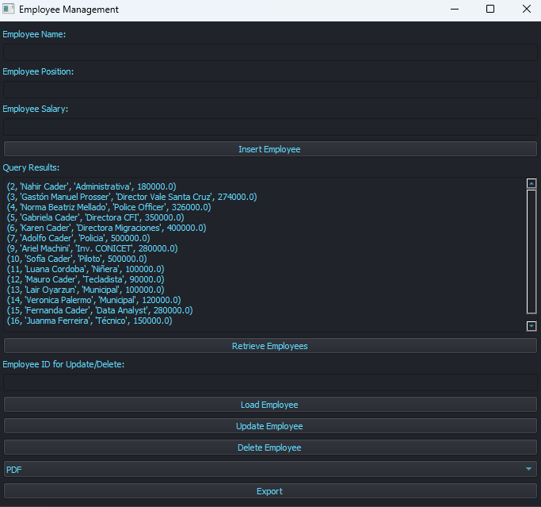

# Employee Records

## Description
This is a Python graphical application that manages an employee database. The application handles tasks such as establishing a database connection, creating an employee table, inserting, querying, updating, and deleting employee records and information within the company.

## Dependencies
The following libraries are imported for the application:
- `sqlite3` and `Error` from `sqlite3`: for database operations
- `tkinter` and `messagebox`: for creating the graphical user interface

## Database Connection
The `crear_conexion()` function is responsible for creating a connection to the database. It uses the SQLite library and returns the connection object.

## Employee Table Creation
The `crear_tabla(conn)` function creates the employee table if it does not already exist. The table has the following columns:
- `id`: integer (primary key)
- `nombre`: text (not null)
- `cargo`: text (not null)
- `salario`: real

## Employee Insertion
The `insertar_empleado(conn, empleado)` function inserts an employee record into the database. It takes the employee's name, position, and salary as parameters and returns the ID of the newly inserted record.

## Employee Query
The `consultar_empleados(conn)` function retrieves all employee records from the database and prints them.

## Employee Update
The `actualizar_empleado(conn, empleado)` function updates an existing employee record. It takes the updated employee information (name, position, salary, and ID) as parameters and commits the changes to the database.

## Employee Deletion
The `eliminar_empleado(conn, id)` function deletes an employee record from the database based on the provided ID.

## Application Window Creation
The `crear_ventana()` function creates the main application window using the Tkinter library. The window title is set to "Employee Management" and its dimensions are set to 800x600 pixels.

## User Interface Components
The application window contains the following user interface elements:
- Text fields for entering employee name, position, salary, and ID
- Buttons for inserting an employee, querying employees, loading an employee, updating an employee, and deleting an employee
- A text area for displaying query results

## Usage
1. Run the application.
2. Enter the employee's name, position, and salary in the corresponding text fields.
3. Click the "Insert Employee" button to add the employee to the database.
4. Click the "Query Employees" button to display all employee records.
5. Enter an employee ID in the designated field and click the "Load Employee" button to load the employee's information for updating or deletion.
6. Make the necessary changes in the text fields for updating an employee's information, and click the "Update Employee" button to save the changes.
7. To delete an employee, enter the employee's ID in the designated field and click the "Delete Employee" button.

Please note that this application assumes the existence of a SQLite database file named "empleados_db.sqlite" in the same directory as the application file.

Feel free to explore the code and modify it according to your needs.